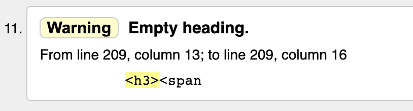
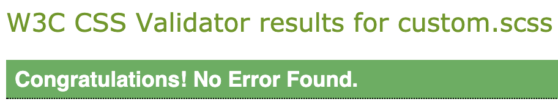
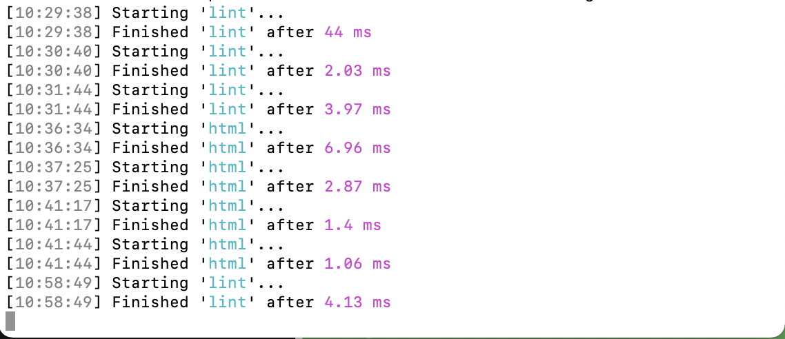
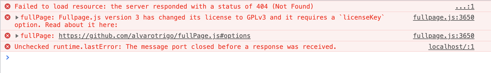

# Queenstown Tourism - Home of Adventure
### Single Page Application by Mohnish Leuva
A single page application or a SPA for Queenstown Tourism, which finds accomodations based on user input, is a summative project for Yoobee Colleges, Wellington, NZ.

Languages used for the completion of this projects are HTML, CSS / SCSS, JS / jQuery and a variety of JS plugins.

### Overview

Queenstown’s journey to becoming an internationally acclaimed four season resort began with the support of Kiwis who used it as a popular summer holiday destination.  As better roads and facilities were developed the town became a picturesque overnight stop for coach tours and became a thriving winter ski resort when Coronet Peak opened in 1947. Queenstown Tourism works with the tourism industry to positively promote Queenstown internationally. They have a new campaign that is aimed at visitors staying for short periods, booking their own accommodation and arranging their own transport.

### Libraries and Plugins

* [jQuery](https://jquery.com/) - mainly for the custom javascript.

* [Fullpage.js](https://alvarotrigo.com/fullPage/) - for making horizontal and vertical scrolls and for a single page application.

* [ScrollOverflow](https://github.com/alvarotrigo/fullPage.js/tree/master/vendors) - for scrolling inside sections and slides of the application.

* [Anime.js](https://animejs.com/) - for animating different targets on the application.

* [Hotel Date Picker](https://github.com/benitolopez/hotel-datepicker) - for a date range picker.

* [Fecha](https://github.com/taylorhakes/fecha) - a must have plugin if you are using Hotel Date picker.

* [Parsley](https://parsleyjs.org/) - for validating inputs on the application.

* [Mapbox](https://www.mapbox.com/) - for integrating maps on the application.

* [FontAwesome 4](https://fontawesome.com/v4.7/) - for different icons.

* [Adobe Fonts](https://fonts.adobe.com/) - for fonts.

* [Gulp](https://gulpjs.com/) - for js linting, sass compiling.

### Production Tools

* Atom - for editing and writing all the necessary code.

* Adobe Photoshop - for resizing and color grading images.

* Adobe XD - for wireframing and concepting.

* Overflow - for creating userflows.

* Google Chrome - for viewing the outputs and inspecting the console for errors or warnings.

* Terminal - for running gulp and pushing to GitHub

### Javascript Style Guide - Idiomatic

* The javascript style guide used in this project is based on Idiomatic Js style guide. Which mainly consists of

  * Eliminating white spaces - keeping the code clean and readable.

  * Beautiful syntax
  ```javascript
    // if/else/for/while/try always have spaces, braces and span multiple lines
    // this encourages readability

    // Examples of really cramped syntax

    if(condition) doSomething();

    while(condition) iterating++;

    for(var i=0;i<100;i++) someIterativeFn();

    // Use whitespace to promote readability

    if ( condition ) {
      // statements
    }

    while ( condition ) {
      // statements
    }

    for ( var i = 0; i < 100; i++ ) {
      // statements
    }
  ```
  * Quotes - either use single quotes or double quotes. **Don't mix up both!**

  * Naming - use proper naming conventions such that human eyes can read that properly, i.e., readable structure.
  ```javascript
      // Example of code with poor names

      function q(s) {
        return document.querySelectorAll(s);
      }
      var i,a=[],els=q("#foo");
      for(i=0;i<els.length;i++){a.push(els[i]);}
  ```
  ```javascript
    // Example of code with improved names

    function query( selector ) {
      return document.querySelectorAll( selector );
    }

    var idx = 0,
      elements = [],
      matches = query("#foo"),
      length = matches.length;

    for ( ; idx < length; idx++ ) {
      elements.push( matches[ idx ] );
    }
    ```

  * Comments
    * Single line above the code that is subject
    * Multiline is good
    * End of line comments are prohibited!

  * Read more about Idiomatic [here](https://github.com/rwaldron/idiomatic.js)


### How it works?

* Card animation
  ```javascript
  anime({

    targets: '.card', //targets classes with card name

    translateY: -500, // changes the position of the cards

    delay: anime.stagger(500, {
      from: 'center' // stagger animation allows to "STAGGER"
    }),

    duration: 2000, //time duration of the animation

    loop: false //doesn't run it in a loop

  });
  ```
* Date Picker
  ```javascript
  var datepicker = new HotelDatepicker(document.getElementById('stayDates'), {

    minNights: 1, // sets minimum nights

    maxNights: 15, // sets maximum nights

    format: 'MMMM D, YYYY' // sets date format

  });
  ```

* Mapbox
  ```javascript
  mapboxgl.accessToken = 'your.token.here';

  var map = new mapboxgl.Map({

    container: 'map', // container ID

    style: 'mapbox://styles/mapbox/light-v10', // style URL

    center: [long.itude, -lat.itude], // starting position [lng, lat]

    zoom: 16 // starting zoom

  });
  ```

* Fullpage js
  ```javascript
  var myFullpage = new fullpage('#fullpage', {

    licenseKey: null,

    controlArrows: false, //hides the control arrows on the slides

    scrollOverflow: true //to scroll inside of sections & slides

  });
  ```
  ```javascript
  fullpage_api.setScrollingSpeed(2000); //setting scrolling speed to 2s
  ```
  ```javascript
  fullpage_api.setAllowScrolling(false); //setting auto scrolling to false
  ```
  ```javascript
  fullpage_api.moveSectionDown(); //moves a section down
  ```
  ```javascript
  fullpage_api.moveSectionUp(); //moves a section down
  ```
  ```javascript
  fullpage_api.moveSlideLeft(); //moves a slide to left
  ```
  ```javascript
  fullpage_api.moveSlideRight(); //moves a slide to right
  ```

* Parsley js
  ```javascript
  //do validation on #formID
  var form = $('#formID').parsley();

  // find #buttonID in #formID and set up a click function on it
  $('#formID').find('#buttonID').click(function() {

    // Validate the form on click
    form.validate();
  });
  ```
  ```javascript
  // only runs when form is successfully validated
  form.subscribe('parsley:form:success', function(e) {
    // HOCUS POCUS
  });
  ```

## Code Validation
  * HTML - using W3 Online HTML Validator
  ```html
  11 warnings, 0 errors
  ```
  ```html
  Warnings regarding empty h1 and h3 tags which are later
  changed via DOM manipulation
  ```
  

  * CSS - using W3 online CSS Validator
  ```html
  0 errors
  ```
    

  * JavaScript - using Gulp linter
  ```html
  0 erros in custom.js file
  ```
    
  ```html
  2 errors regarding Fullpage licensing in the console
  As I am using latest version 3.1.1 which needs a license key to run
  Using 2.9.6 / 2.9.7 broke the code so using 3.1.1
  ```
  ```html
  1 error regarding Gulp localhost in the console
  ```
  

## Future Development
* As for the future development, I would like to implement transport options to the application, which would allow users to select a transport option based on their inputs.

## Copyright
* Video - Tourism New Zealand
* Images - Unsplash.com & Queenstown Tourism
* Fonts - Adobe Fonts
